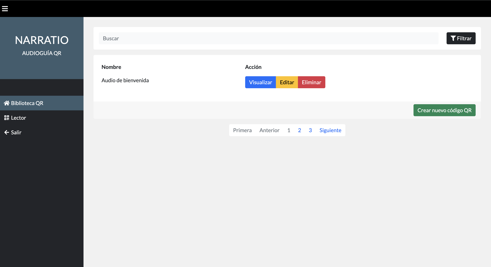
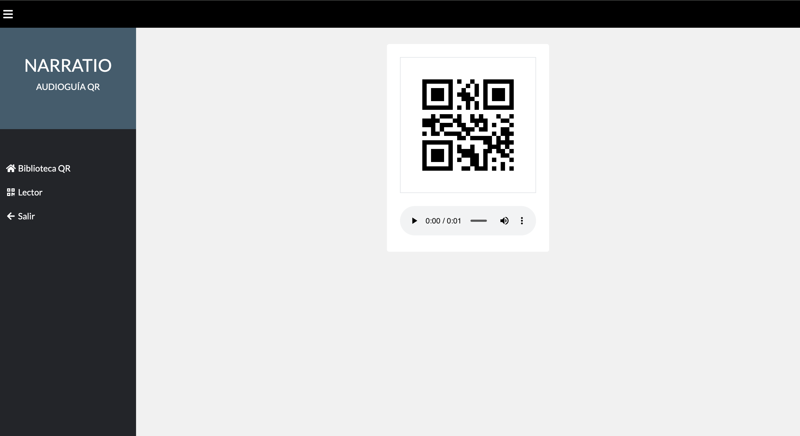
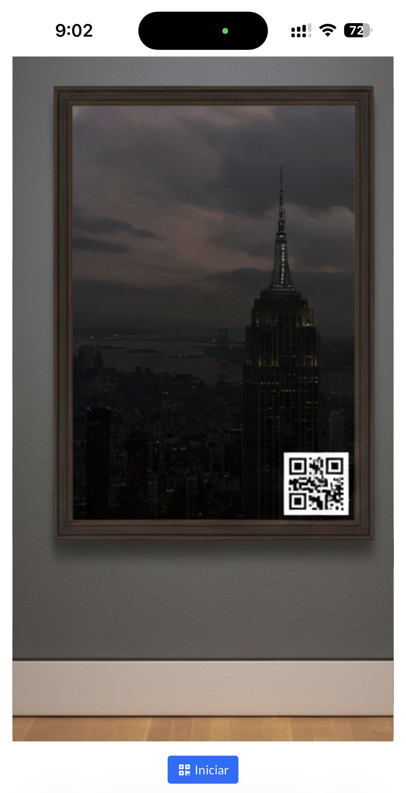

# NARRATIO: UNA AUDIOGUÍA QR PARA ESPACIOS PÚBLICOS

**NARRATIO** es una aplicación web orientada a la gestión general de códigos QR. El objetivo principal de este sistema es facilitar la gestión de códigos QR en espacios públicos. Además, a través de códigos QR estratégicamente ubicados, el sistema puede permitir que el usuario tenga acceso a contenido auditivo sin la necesidad de una aplicación móvil.

## Características

- **Generación automática de códigos QR**
	- Permite la carga directa de archivos en formato MP3
	- Incluye un editor de texto para convertirlo automáticamente en una narración.

 ## Galería

| Dashboard | Código QR | Escáner |
| :---: | :---: | :---: |
|  |  | |

## Tecnologías

- **Lenguaje Principal de Programación:** Python 3.14.3
- **Sistema Gestor de Base de Datos:** MySQL 9.5.0
- **Librerías:** Flask 3.1.2 - gTTS 2.5.4 - PyQRCode 1.2.1
